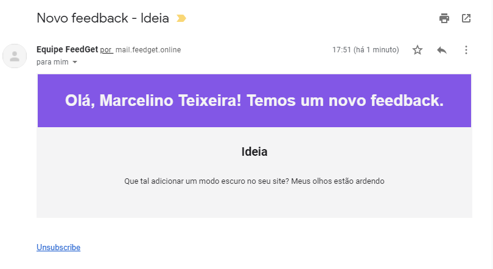

<h1 align="center">
  FeedGet - NodeJS
</h1>

  <a href="#-projeto">Projeto</a>&nbsp;&nbsp;&nbsp;|&nbsp;&nbsp;&nbsp;
  <a href="#-tecnologias">Tecnologias</a>&nbsp;&nbsp;&nbsp;|&nbsp;&nbsp;&nbsp;
  <a href="#-funcionalidades">Funcionalidades</a>

 

  

## 💻 Projeto

Este é o backend da <a href="https://feedget.online" target="_blank">aplicação FeedGet</a>, uma API em NodeJS com Typescript utilizando o Prisma ORM. Integrado ao Mailgun, executa o serviço de emails a cada feedback recebido. Foi desenvolvido como um aprimoramento do projeto da NLW #8 da Rocketseat, utilizando os princípios do SOLID.

## 🧪 Tecnologias

Esse projeto foi desenvolvido com as seguintes tecnologias:

- [NodeJS](https://nodejs.org/)
- [TypeScript](https://www.typescriptlang.org/)
- [TailwindCSS](https://www.prisma.io/)
- [Mailgun](https://www.mailgun.com/)

## 💣 Funcionalidades

- Serviço de envio de emails a cada feedback criado utilizando o Mailgun
- Integração com o OAuth do Github para criação de usuários
- Integração com o dashboard para listagem de feedbacks da aplicação

Repositório da lib FeedGet: <a href="https://github.com/Marceometry/feedget" target="_blank">https://github.com/Marceometry/feedget</a>

Repositório da documentação/dashboard: <a href="https://github.com/Marceometry/NLW-FeedGet-ReactJS" target="_blank">https://github.com/Marceometry/NLW-FeedGet-ReactJS</a>

---

<h4 align="center"> Feito com ♥ por Marcelino Teixeira </h4>
